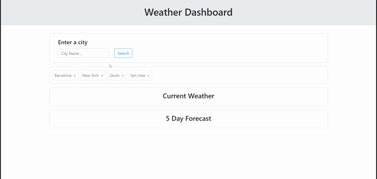

# Weather Dashboard

A web application to search up cities to view their current weather and 5 day weather forecast. Previous searches are saved in local storage.

## Description

This web application uses the OpenWeather API to retrieve location and weather data including temperature, humidity, wind speed, UV index and a 5 day forecast. The user can search for the name of a city to get weather info for that city. They can see previously searched cities by clicking on the list in the search history. They can also delete previous searches using the 'x' button on each search term.

## Installation

Upload all files or fork from the repository to your server or deploy on Github Pages. The website linked below is deployed using Github Pages.

## Usage

Link to deployed site: https://seannoh.github.io/weather-dashboard/  

Type the name of a city into the search bar and click the search button to see weather info and save the search. Click on a previous search to bring up weather info for that city or click on the adjacent 'x' button to delete that search.

### Preview



## Technologies Used

- HTML
- CSS
- [JavaScript](www.javascript.com)
- [jQuery](https://jquery.com/)
- [jQuery UI](https://jqueryui.com/)
- [Bootstrap](https://getbootstrap.com/)
- [Moment.js](https://momentjs.com/)
- [OpenWeather API](https://openweathermap.org/)

## Code Snippets

The addToPreviousSearches() function takes in a stringified object, parses and adds that object to the array of previous searches if it doesn't already exist. I used JSON.stringify() and JSON.parse() as a workaround here to get past JavaScript's pass-by-reference rule for objects. If you do pass the object by reference, any modifications to the object passed into the function would affect the object outside as well. So, we convert the object to a string first so a deep copy is made.

<details>
<summary>Click to see code snippet of addToPreviousSearches()</summary>

```
// add city to list of previous searches
  function addToPreviousSearches(stringyCity) {
    /* Check if it's already in the list */
    var city = JSON.parse(stringyCity);

    if (!(previousCities.some(function(e) {return (e.currLat == city.currLat) && (e.currLong == city.currLong)}))) {
      previousCities.push(city);
    }
  }
```
</details>
<br>

## Credits

This application was built with the support of the resources and staff of the UCB Full Stack Full Time Coding Bootcamp Summer 2022.

### References Used

- https://jqueryui.com/autocomplete/
- https://api.jquery.com/jQuery.ajax/
- https://developer.mozilla.org/en-US/docs/Web/JavaScript/Guide/Regular_Expressions
- https://worldpopulationreview.com/world-cities
- https://stackoverflow.com/questions/7574054/javascript-how-to-pass-object-by-value

## Author

This project was created by Sean Oh. 
- [Github](https://github.com/seannoh)
- [Linkedin](https://www.linkedin.com/in/sean-oh-bb9781241/)
- [Portfolio](https://seannoh.github.io/portfolio)

## License

<details>
<summary>MIT License</summary>

MIT License

Copyright (c) 2022 Sean Oh

Permission is hereby granted, free of charge, to any person obtaining a copy
of this software and associated documentation files (the "Software"), to deal
in the Software without restriction, including without limitation the rights
to use, copy, modify, merge, publish, distribute, sublicense, and/or sell
copies of the Software, and to permit persons to whom the Software is
furnished to do so, subject to the following conditions:

The above copyright notice and this permission notice shall be included in all
copies or substantial portions of the Software.

THE SOFTWARE IS PROVIDED "AS IS", WITHOUT WARRANTY OF ANY KIND, EXPRESS OR
IMPLIED, INCLUDING BUT NOT LIMITED TO THE WARRANTIES OF MERCHANTABILITY,
FITNESS FOR A PARTICULAR PURPOSE AND NONINFRINGEMENT. IN NO EVENT SHALL THE
AUTHORS OR COPYRIGHT HOLDERS BE LIABLE FOR ANY CLAIM, DAMAGES OR OTHER
LIABILITY, WHETHER IN AN ACTION OF CONTRACT, TORT OR OTHERWISE, ARISING FROM,
OUT OF OR IN CONNECTION WITH THE SOFTWARE OR THE USE OR OTHER DEALINGS IN THE
SOFTWARE.

</details>


